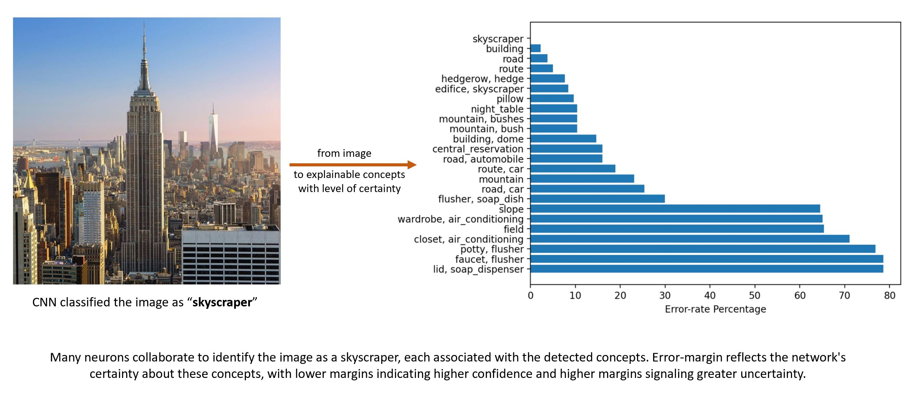

# ConceptLens: from Pixels to Understanding



## Summary
Dive into the vibrant world of ConceptLens, where we turn the complex labyrinths of artificial neural networks into a visual spectacle of understanding! At ConceptLens, we pride ourselves on our pioneering approach to interpreting hidden neuron activations. Our unique blend of advanced deep learning models and symbolic methods illuminates the once obscure decision-making of neural networks. It’s like having a conversation with the AI itself, as you uncover what activates neurons and how they react to various stimuli—this is our error-margin analysis in action, a feature you’ll find only with us.

Our intuitive interface invites you to upload images and witness the magic unfold in real-time effortlessly. The results? A detailed, colorful visualization that not only educates but also captivates. It’s a gateway to understanding neuron functionality like never before, pushing the boundaries of what’s possible in deep learning.

For a deep dive into the science behind our platform, our [*Research Paper*](https://arxiv.org/abs/2405.09580) - “Error-margin Analysis for Hidden Neuron Activation Labels” awaits your curiosity. We envision a world where researchers like you leverage ConceptLens to unlock groundbreaking insights into images.

## Local Installation
1. **Clone the repository:**
   ```bash
   git clone <repository_url>
   cd <repository_directory>
2. **Install the required dependencies:** 
Make sure you have all the necessary requirements by referring to the requirements.txt file:
   ```bash
   pip install -r requirements.txt
   ```
4. **Run the project:**
   ```bash
   streamlit run Home.py
   ```

## Authors
Please feel free to contact with any issues, comments, or questions.
### Abhilekha Dalal
**Email:** [adalal@ksu.edu](mailto:adalal@ksu.edu)  
**GitHub:** [https://github.com/abhilekha-dalal](https://github.com/abhilekha-dalal)

